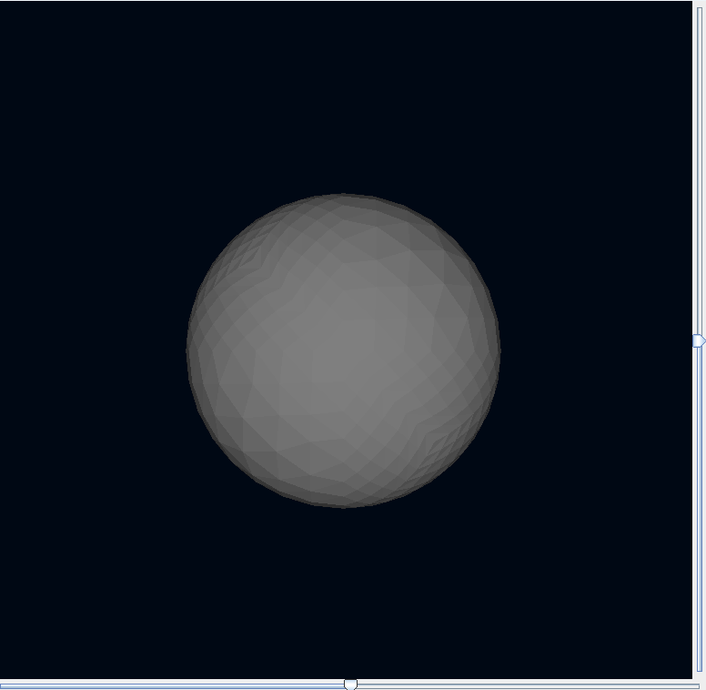

# Development to 3D render using Java

### Topics
- Rotation XZ and YZ
- Colors
- Shades 
- Depth

### Technology
- Java 16 (SDK)
- Intellij (IDE)

### Building & Run
Once you create and clone the repository, remove the 'out' repository and on Intellij choose your Sdk and run the aplication.

# Final result

